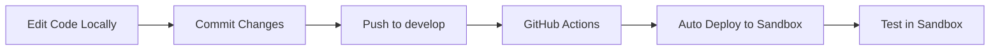
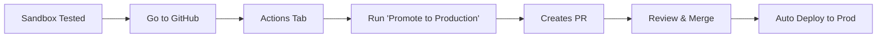

# Cloud-First Development Workflow

This project uses a **cloud-first** development approach where the sandbox environment IS your development environment.

## Overview

Instead of traditional local development, we embrace the cloud:
- **No local database setup required**
- **No local IIS or Kestrel configuration**
- **Automatic deployments to sandbox**
- **Real cloud environment for testing**

## Workflow

### 1. Development Flow



### 2. Quick Start

```bash
# 1. Make your changes
git checkout develop
code .  # Edit in VS Code or Visual Studio

# 2. Commit and push
git add .
git commit -m "feat: your awesome feature"
git push origin develop

# 3. Wait 2-3 minutes
# Check: https://app-steel-estimation-prod-staging.azurewebsites.net
```

### 3. Production Deployment



## Environment URLs

| Environment | URL | Branch | Deployment |
|-------------|-----|---------|------------|
| Sandbox | https://app-steel-estimation-prod-staging.azurewebsites.net | `develop` | Automatic |
| Production | https://app-steel-estimation-prod.azurewebsites.net | `master` | Manual approval |

## Benefits

### ✅ Why Cloud-First?

1. **No Setup Required**
   - Start coding immediately
   - No "works on my machine" issues
   - New team members productive in minutes

2. **Real Environment Testing**
   - Test with actual Azure services
   - Real database connections
   - Actual authentication flows

3. **Automatic Everything**
   - Push code → Deployed automatically
   - No manual build steps
   - No deployment scripts to run

4. **Cost Effective**
   - Sandbox uses minimal resources
   - Shared infrastructure
   - No local SQL Server licenses

## Common Tasks

### Checking Deployment Status

1. **GitHub Actions**:
   - Go to: https://github.com/Dom98-AU/Steel-Estimation-Platform/actions
   - See all deployments and their status

2. **Environment Status Page**:
   - Login to the app
   - Navigate to: Admin → Environment Status
   - See current versions and health

### Making Changes

```bash
# Always work on develop
git checkout develop
git pull origin develop

# Make changes
# Test locally if needed (optional)
# Or just push and test in sandbox

git add .
git commit -m "fix: resolved issue #123"
git push origin develop

# Watch the magic happen!
```

### Debugging Issues

Since you're not running locally, debugging is different:

1. **Application Logs**:
   - Azure Portal → App Service → Log Stream
   - Or use the Kudu console

2. **Browser DevTools**:
   - F12 in browser
   - Check Network tab for API calls
   - Console for JavaScript errors

3. **Quick Iterations**:
   - Small commits, push often
   - 2-3 minute feedback loop
   - Fix and push again

## FAQ

### Q: Can I still run locally if needed?
A: Yes! Just configure `appsettings.Development.json` with the sandbox database connection string.

### Q: What if I break sandbox?
A: No worries! Fix the issue and push again. Sandbox is meant for experimenting.

### Q: How do I test database changes?
A: Make your Entity Framework changes, push to develop. Migrations run automatically in sandbox.

### Q: Can multiple developers work simultaneously?
A: Yes, but they share the sandbox. Consider feature branches that auto-deploy to separate slots (future enhancement).

### Q: What about API testing tools?
A: Use Postman/Insomnia against the sandbox URL. No localhost needed!

## Best Practices

1. **Commit Often**: Small, frequent commits are better than large ones
2. **Clear Messages**: Use conventional commits (feat:, fix:, docs:)
3. **Test in Sandbox**: Always verify in sandbox before promoting
4. **Monitor Deployments**: Check GitHub Actions for deployment status
5. **Quick Rollback**: If something breaks, revert the commit and push

## Emergency Procedures

### Sandbox is Broken
```bash
# Option 1: Fix forward
git add .
git commit -m "fix: emergency fix for sandbox"
git push origin develop

# Option 2: Revert last commit
git revert HEAD
git push origin develop
```

### Production Issues
```powershell
# Use Azure Portal to swap slots back
az webapp deployment slot swap --resource-group NWIApps --name app-steel-estimation-prod --slot staging
```

## Conclusion

Embrace the cloud! No more local environment hassles. Just code, push, and see your changes live in minutes. This is modern development! 🚀